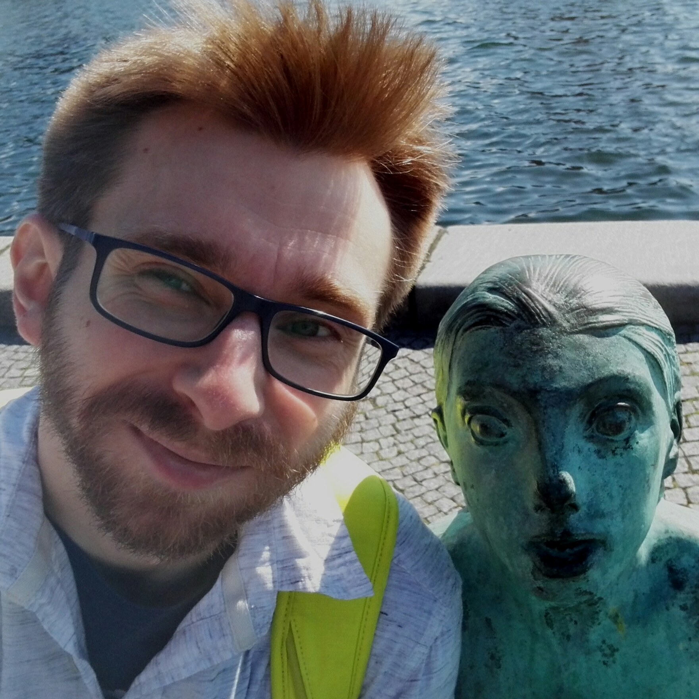

# Miikka Silfverberg

 I am a postdoc at the Department of Linguistics at University of Colorado Boulder after having defended my PhD thesis on morphological tagging in October 2016. I work in the fields of Natural language processing (NLP) and Computational linguistics. My research interests include NLP for morphologically complex languages, computational semantic, morphological tagging, parsing, and computational morphology.

## Recent Publications (2015-)

## Software

## Talks

## Teaching