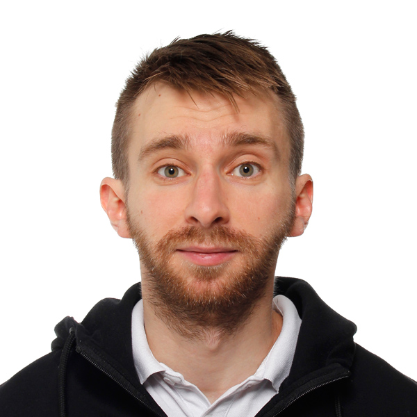

 I am a postdoc at the [Department of Linguistics](https://www.colorado.edu/linguistics/) at University of Colorado Boulder working in the [CLEAR group](https://www.colorado.edu/lab/clear/). I got my PhD at the University of Helsinki in Finland, where I worked in the [Helsinki Finite-State Technology](http://hfst.github.io/) research group. In October 2016, I defended my PhD thesis on morphological tagging at the Department of Modern Languages at the University of Helsinki. My work mostly falls within the fields of Natural language processing (NLP) and Computational linguistics. My research interests include NLP for morphologically complex languages, computational semantics, morphological tagging, parsing, and computational morphology.

**Find me on**

[Google Scholar](https://scholar.google.com/citations?user=0ey1PKYAAAAJ&hl=en), [GitHub](https://github.com/mpsilfve), [LinkedIn](https://fi.linkedin.com/in/miikka-silfverberg-78146019), [OGS](https://online-go.com/player/131477/)

**Contact**

My email address is of the form first.last@colorado.edu. Please
observe that there are two i's and two k's in "Miikka" and that
"Silfverberg" is spelled with "fv".

## Recent Publications (2015-)

**Miikka Silfverberg**, Lingshuang Jack Mao and Mans Hulden (accepted, 2018). _Sound Analogies with Phoneme Embeddings_. Inaugural Meeting of SCIL.

**Miikka Silfverberg** and Mans Hulden (2017). _Automatic Morpheme Segmentation and Labeling in Universal Dependencies resources_. Universal Dependency Workshop at NoDaLiDa.

**Miikka Silfverberg** and Mans Hulden (2017). _Weakly supervised learning of allomorphy_. SCLEM.

**Miikka Silfverberg**, Adam Wiemerslage, Ling Liu and Lingshuang Jack Mao (2017). _Data Augmentation for Morphological Reinflection_. CoNLL SIGMORPHON 2017 Shared Task: Universal Morphological Reinflection.

**Miikka Silfverberg**, Teemu Ruokolainen, Krister Lindén and Mikko Kurimo (2016). _FinnPos: an open-source morphological tagging and lemmatization toolkit for Finnish_. Language Resources and Evaluation 50 (4).

**Miikka Silfverberg**, Pekka Kauppinen and Krister Lindén (2016). _Data-driven spelling correction using weighted finite-state methods_. STATFSM.

Krister Lindén, Sam Hardwick, **Miikka Silfverberg** and Erik Axelson (2015). _Using HFST—Helsinki Finite-State Technology for Recognizing Semantic Frames_. SFCM.

**Miikka Silfverberg** and Jack Rueter (2015). _Can Morphological Analyzers Improve the Quality of Optical Character Recognition?_. IWCLUL.

Sam Hardwick, **Miikka Silfverberg** and Krister Lindén (2015). _Extracting Semantic Frames using hfst-pmatch_. NoDaLiDa.

Senka Drobac, **Miikka Silfverberg** and Krister Lindén (2015). _Automated Lossless Hyper-Minimization for Morphological Analyzers_. FSMNLP.

Mans Hulden, **Miikka Silfverberg** and Jerid Francom (2015). _Kernel Density Estimation for Text-Based Geolocation_. AAAI.

## Thesis 

[Morphological Disambiguation using
Probabilistic Sequence Models](https://helda.helsinki.fi/bitstream/handle/10138/167029/morpholo.pdf?sequence=1)

## Software Projects

[The FinnPos morphological tagging toolkit](https://github.com/mpsilfve/finnpos)

[The HFST toolkit for finite-state algebra](http://hfst.github.io/)

## Talks

_GRoW Your LaTeX Skills_. Invited tutorial at the Graduate Research
Workshop at the Department of Linguistics at University of Colorado
Boulder, Boulder, CO. 09/2017.

_Open-Source Optical Character Recognition_. Invited tutorial at
Langnet Graduate School, Turku, Finland. 05/2015.

_Morphological Disambiguation using Probabilistic Sequence
Models_. Invited talk at Computational Semantics Seminar at University
of Colorado Boulder, Boulder, CO. 01/2015.

_Corpus Tools_. Invited talk at Langnet Graduate School, Turku,
Finland. 12/2014.

_Probabilistic parsing with weighted FSTs_. Invited tutorial at
FSMNLP, Donostia, Spain. 07/2012.

## Misc. Teaching Materials

[Mathematics handout](https://www.overleaf.com/read/vptxdcbwqnjz) for a study group based on Yoav Goldberg's "Neural Network Methods for Natural Language Processing".