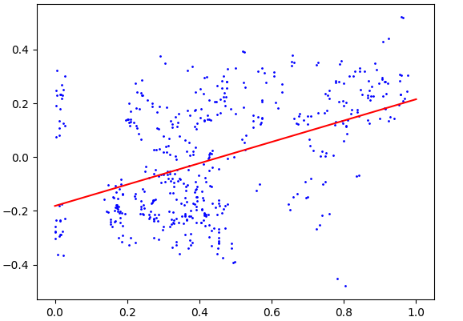

## Selected Publications

**Miikka Silfverberg**, Lingshuang Jack Mao and Mans Hulden (accepted, 2018).
_Sound Analogies with Phoneme Embeddings_ ([**PDF**](assets/analogies.pdf)).
Inaugural Meeting of SCIL

 Vector space models of words in NLP&mdash;word embeddings&mdash;have been
recently shown to reliably encode semantic information. We study how
well these distributional properties carry over to similarly learned
phoneme embeddings, and whether phoneme vector spaces align with
articulatory distinctive features. We demonstrate a statistically
significant correlation between distinctive feature spaces and
distributionally learned vector spaces.

&nbsp;

**Miikka Silfverberg**, Adam Wiemerslage, Ling Liu and Lingshuang Jack Mao (2017). _Data Augmentation for Morphological Reinflection_ ([**PDF**](assets/reinflection.pdf)). CoNLL SIGMORPHON 2017 Shared Task: Universal Morphological Reinflection

 This paper presents the submission of the CU Boulder
Linguistics team for the 2017 CoNLL-SIGMORPHON shared task on morphological
reinflection. The system is an RNN Encoder-Decoder model which is
specifically geared toward a low-resource setting. To this end, it
employs data augmentation to counteract overfitting and a copy symbol
for processing characters unseen in the training data. The system is
tested on the reinflection task for 52 languages using three data
settings low (100 training examples), medium (1000 training examples),
and high (10,000 training examples). The experiments show that data
augmentation allows the system to learn models even in low resource
settings which are very challenging for traditional RNN
encoder-decoder systems.

&nbsp;

**Miikka Silfverberg** and Mans Hulden (2017). _Weakly Supervised
Learning of Allomorphy_ ([**PDF**](assets/allomorphy.pdf)). SCLEM

 Most NLP resources that offer annotations at the word segment level
provide morphological annotation that includes features indicating
tense, aspect, modality, gender, case, and other inflectional
information.  Such information is, however, rarely aligned to the
relevant parts of the words. In this paper, we explore several methods
to learn this latent alignment between parts of word forms and the
grammatical information provided.

**Miikka Silfverberg**, Teemu Ruokolainen, Krister Lindén and Mikko Kurimo (2016). _FinnPos: An Open-Source Morphological Tagging and Lemmatization Toolkit for Finnish_ ([**PDF**](assets/finnpos.pdf)). Language Resources and Evaluation 50 (4)

This paper describes FinnPos, an open-source morphological tagging
and lemmatization toolkit for Finnish. The morphological tagging model
is based on the averaged structured perceptron classifier and
lemmatization is performed employing a combination of a rule-based
morphological analyzer and a data-driven lemmatization
model.

**Miikka Silfverberg**, Teemu Ruokolainen, Krister Lindén and Mikko Kurimo (2014). _Part-of-Speech Tagging using Conditional Random Fields: Exploiting Sub-Label Dependencies for Improved Accuracy_ ([**PDF**](assets/sublabel.pdf)). ACL

This paper investigates POS tagging in presence of large,
fine-grained label sets using CRFs. It proposes to improve tagging
accuracy by utilizing dependencies within sub-components of the
fine-grained labels.  Experiments on English, Romanian, Czech,
Estonian and Finnish show that the approach can yield significant
improvement in tagging accuracy.

## Software

[**FinnPos**](https://github.com/mpsilfve/FinnPos)

FinnPos is a morphological tagging and lemmatization toolkit for morphologically rich languages such as Finnish. It is based on the averaged perceptron framework and features

* State-of-the-art tagging accuracy.
* Fast estimation and application.
* Support for large label sets exceeding 1000 label types.
* An option to use taggers for morphological disambiguation.
* Data driven lemmatization for OOV words.
* Feature extraction using sub-labels of structured morphological labels (e.g. "Noun+Plural+Nominative").
* Customizable feature extraction.

FinnPos is implemented by myself and Teemu Ruokolainen.

[**HFST**](http://hfst.github.io/)

The Helsinki Finite-State Transducer toolkit is intended for
processing natural language morphologies. The toolkit is demonstrated
by wide-coverage implementations of a number of languages of varying
morphological complexity.

I implemented and helped design several component of HFST. On of
the most prominent components is `hfst-twolc` which is a compiler
for two-level phonological rules.